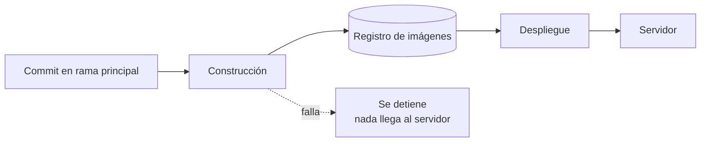
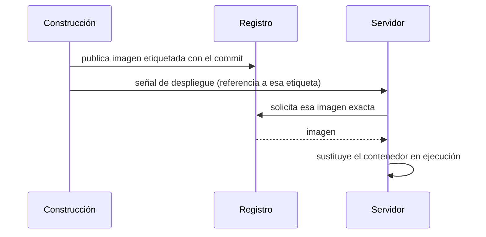
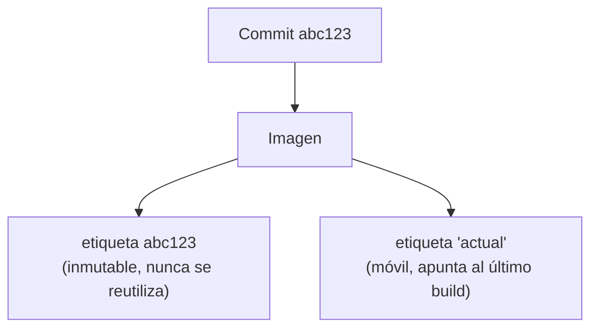
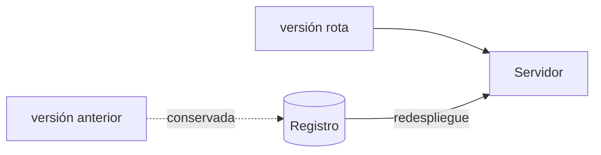

# CI/CD — Modelo de despliegue

## Principio

**La imagen es la unidad de despliegue.** Se construye una vez, a partir de un commit
concreto, y esa misma imagen es la que acaba ejecutándose. El servidor nunca compila:
solo descarga y arranca.

De ahí se derivan el resto de propiedades del sistema.

---

## Flujo

Dos etapas con responsabilidades separadas:

| Etapa | Dónde | Coste | Efecto si falla |
|---|---|---|---|
| Construcción | Infraestructura efímera | Alto (CPU, RAM, disco) | Ninguno: producción sigue intacta |
| Despliegue | Servidor | Bajo (descarga + reinicio) | Acotado: la versión anterior sigue disponible |

La separación no es estética. La construcción es cara y puede repetirse sin consecuencias;
el despliegue es barato pero toca estado real. Mezclarlas hace que un pico de recursos
durante una compilación pueda degradar servicios que ya estaban funcionando.

---

## Contrato entre etapas

El registro de imágenes es lo único que ambas etapas comparten. No hay código fuente
viajando al servidor, ni credenciales de construcción almacenadas en él.

La señal de despliegue **no transporta el artefacto**: solo nombra cuál debe usarse.
El servidor va a buscarlo. Así el canal de control y el canal de datos quedan separados,
y el permiso que necesita cada parte es mínimo:

- La construcción necesita **escribir** en el registro y **avisar** al servidor.
- El servidor necesita **leer** del registro. Nada más.

---

## Identidad del artefacto

Cada imagen se etiqueta de dos formas simultáneas:

- La **etiqueta inmutable** responde a "qué código está corriendo exactamente".
  Es la que hace posible el rollback y la que se usa al desplegar.
- La **etiqueta móvil** responde a "cuál es la última versión". Es cómoda, pero
  ambigua: dos consultas en momentos distintos pueden devolver imágenes diferentes.

Desplegar por etiqueta móvil hace el sistema no reproducible. Desplegar por etiqueta
inmutable convierte cada despliegue en un hecho verificable.

---

## Reversión

Como las imágenes antiguas siguen existiendo en el registro, volver atrás **no requiere
reconstruir nada**: es desplegar una etiqueta anterior.

Esto cambia el coste del error. Revertir por reconstrucción implica revertir el código,
esperar una compilación completa y confiar en que produzca lo mismo que antes. Revertir
por artefacto es descargar algo que ya funcionó.

---

## Propiedades que el modelo garantiza

**Idempotencia.** Repetir el despliegue del mismo commit converge al mismo estado.
Reintentar nunca es peligroso.

**Ausencia de deriva.** Lo que se probó y lo que se ejecuta son el mismo binario. No
existe la clase de fallo "compilaba en CI pero no en el servidor", porque solo se compila
una vez.

**Aislamiento del fallo.** Un error de compilación se detiene antes de tocar el servidor.
La versión en ejecución solo se sustituye cuando ya existe un artefacto válido.

**Trazabilidad.** La etiqueta de la imagen en ejecución identifica el commit exacto que
la originó.

---

## Modos de fallo

| Fallo | Síntoma | Estado del servicio |
|---|---|---|
| Compilación | El pipeline se detiene en la primera etapa | Intacto, sigue la versión anterior |
| Publicación en registro | Hay imagen, pero no es accesible | Intacto, no se llega a desplegar |
| Señal al servidor | Imagen publicada, servidor sin actualizar | Intacto, desfasado; se resuelve reintentando |
| Arranque del contenedor | Imagen descargada, proceso no levanta | Degradado: requiere redesplegar la etiqueta anterior |

Los tres primeros son inocuos: el sistema se queda donde estaba. Solo el último afecta al
servicio, y es justamente el que la reversión por artefacto resuelve en segundos.

---

## Límites conocidos

- **Sin entorno de preproducción.** La rama principal va directa a producción. Es una
  decisión deliberada de simplicidad, no un descuido: añadir una etapa intermedia es
  duplicar el despliegue apuntando a otro destino.
- **Sin verificación posterior al arranque.** El pipeline confirma que el contenedor se
  creó, no que la aplicación responda correctamente. Detectar un arranque fallido depende
  de comprobación externa.
- **El registro es un punto único de fallo** en el momento del despliegue. No afecta a lo
  que ya está en ejecución.
