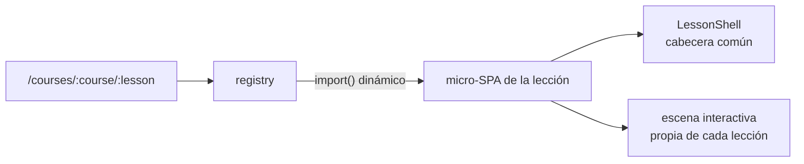

# Lecciones — Arquitectura y propuesta técnica

## Modelo

Cada lección es una **micro-SPA autocontenida**: un componente cliente en
`src/lessons/<slug>/` que solo conoce React. No importa nada de Next ni de las
rutas; el registry (`src/lessons/registry.ts`) la conecta con su URL y la carga
como chunk independiente. Extraer una lección a otro proyecto es mover una carpeta.

El patrón interno común es **escenas secuenciales**: la lección avanza por pasos
discretos (como diapositivas), pero dentro de cada paso el estado es continuo y
manipulable. Guion arriba, juguete abajo.

## Stack común

| Necesidad | Elección | Por qué |
|---|---|---|
| Componentes UI | shadcn/ui (radix-nova) | Ya instalado; accesible por defecto |
| Animación | `motion` (ex framer-motion) | Layout animations: un elemento "viaja" entre contenedores con 3 líneas |
| Diagramas de nodos | `@xyflow/react` (React Flow) | Grafos interactivos con pan/zoom resueltos; ideal para redes y pipelines |
| Código resaltado | `shiki` | Resaltado en build, cero JS en cliente; tema acoplable a la paleta |
| Estado de escena | `useReducer` + contexto por lección | Las escenas son máquinas de estados pequeñas; XState sería sobreingeniería hoy |

Se instalan **por lección, cuando se construye la primera que los usa** — no antes.

## Propuesta por lección

### 01 · computation — La máquina desnuda
**Escena:** tres "edificios" (CPU, RAM, disco) en SVG propio + panel de código
Python con resaltado shiki. Al ejecutar paso a paso, cada línea emite una
partícula (`motion` layout animation) que viaja: `x = 3` → aparece celda en RAM;
`x + y` → las celdas entran en la CPU y sale una nueva; `save()` → viaje lento
al disco. Botón "apagar": la RAM se vacía con stagger, el disco persiste.
**Técnica:** SVG + motion. Sin canvas: pocos elementos, mucha semántica.
**Simplificación asumida:** una instrucción Python = una instrucción de máquina.
Se declara en un aside "mentira piadosa" — patrón a repetir en todo el curso.

### 02 · operating-systems — El intermediario
**Escena:** la misma ciudad, ahora con una franja "recepción" (el SO). Dos
programas piden memoria: el SO pinta parcelas de colores en la RAM; un programa
intenta leer la parcela ajena y rebota. Syscalls como ventanilla: la petición
cambia de carril visualmente. Timeline de turnos de CPU (scheduling) como
carrusel.
**Técnica:** reutiliza los componentes visuales de la 01 (mismo SVG kit,
`src/lessons/_shared/` cuando aparezca la segunda lección que lo necesite).
Continuidad visual = continuidad conceptual.

### 03 · internet — Ordenadores que se hablan
**Escena:** React Flow. Empieza con 2 nodos y un cable; un mensaje se trocea en
paquetes numerados que viajan por la arista (animación sobre el path SVG del
edge). Escala a un grafo de ~20 nodos con routers; el alumno marca origen y
destino y ve la ruta; se cae un router y los paquetes re-rutean. DNS como
overlay: primero se consulta "la agenda", luego viajan los paquetes.
**Técnica:** `@xyflow/react` + edges animados custom. Es la lección donde React
Flow paga el peso: pan/zoom/layout gratis.

### 04 · software-lifecycle — Del play a producción
**Escena:** pipeline como cinta transportadora horizontal (motion). Commits como
cajas que avanzan por estaciones: build → tests → deploy. Un test falla: la caja
se expulsa y producción ni se entera. Deploy azul/verde: dos entornos, el
tráfico (partículas continuas) cambia de tubería sin cortarse. Rollback con un
botón: la caja anterior vuelve.
**Técnica:** motion + shadcn. Conecta explícitamente con `docs/cicd.md` — el
sitio se despliega a sí mismo con el modelo que enseña, y eso se cuenta.

### 05 · llms — La caja que completa texto
**Escena:** caja negra centrada. Fase 1: entra un prompt, sale una continuación,
con las probabilidades de las 5 palabras candidatas visibles en cada paso
(animación token a token). Fase 2: un chat shadcn al lado; cada turno muestra
cómo TODO el historial se re-concatena y entra de nuevo — el "recuerdo"
desmitificado. Fase 3: la ventana de contexto como cinta que se llena y
desborda por el principio.
**Técnica:** motion para el flujo de tokens; datos precalculados (sin modelo
real ni API): las probabilidades son fijas y elegidas para contar la historia,
y así la lección funciona offline y es determinista.

### 06 · ai-agents — La caja con manos
**Escena:** tres paneles: chat (izquierda), bucle del harness (centro, estados:
pensar → proponer tool → ejecutar → observar), y "lo que el modelo ve de
verdad" (derecha: el contexto crudo que crece turno a turno, AGENTS.md
inyectado, la skill que aparece cuando se carga). El alumno lanza una tarea
simulada y avanza el bucle a cámara lenta, abriendo cualquier mensaje
intermedio.
**Técnica:** reutiliza el chat de la 05. La simulación es un guion determinista
(array de turnos), no un agente real: reproducible, sin coste y sin sorpresas.
**Es la tesis del curso aplicada:** quitar la magia enseñando el mecanismo.

## Criterios transversales

- **Determinismo:** ninguna lección llama a servicios externos. Todo simulado
  con datos fijos. Reproducible, offline, sin coste por visita.
- **Mentiras piadosas declaradas:** cada simplificación fuerte lleva un aside
  que la reconoce y apunta la versión real. Simplificar sin avisar es mentir.
- **Reutilización por extracción:** nada de `_shared/` especulativo. Cuando dos
  lecciones necesiten la misma pieza, se extrae; antes no.
- **Texto en castellano, código e identificadores en inglés.**
